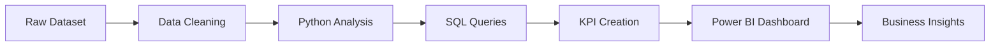

<div align="center">


<br>


<br>


</div>

---

# ✨ Project Overview

This project analyzes Amazon sales data to uncover revenue trends, customer purchasing behavior, product performance, payment preferences, and regional sales using **Python, SQL, and Power BI**.

The dashboard enables business stakeholders to monitor KPIs, identify growth opportunities, and make data-driven decisions through interactive visualizations.

---

# 🎯 Objectives

- Analyze overall sales performance
- Identify top-performing products & categories
- Understand customer purchasing behavior
- Monitor regional sales trends
- Track shipping performance
- Build an interactive executive dashboard

---

# 📊 Dashboard KPIs

<div align="center">

| 💰 Revenue | 📦 Orders | 🛒 Quantity Sold | 📈 Average Order Value |
|-----------|-----------|-----------------|-----------------------|
| Executive KPI | Business KPI | Sales KPI | Performance KPI |

| 🚚 Shipping Cost | 💳 Payment Method | ⭐ Top Products | 🌍 Regional Sales |
|----------------|-----------------|---------------|------------------|
| Logistics KPI | Customer KPI | Product KPI | Geographic KPI |

</div>

---

# 🛠 Technology Stack

| Tool | Purpose |
|------|---------|
| 🐍 Python | Data Cleaning & EDA |
| 🗄 SQL | Business Queries |
| 📊 Power BI | Dashboard Development |
| ⚡ DAX | KPI Calculations |
| 🔄 Power Query | Data Transformation |
| 📑 Excel/CSV | Data Source |

---

# ⚙ Analytics Workflow



---

# ❓ Business Questions

- Which products generate the highest sales?
- Which category performs the best?
- Which brand sells the most?
- What are the monthly sales trends?
- Which payment methods are preferred?
- Which countries, states, and cities contribute the highest revenue?
- What is the average shipping cost?
- Which products receive the highest discounts?
- Which customers generate maximum revenue?
- What are the overall sales KPIs?

---

# 💡 Key Insights

✅ Identified top-performing products and categories.

✅ Analyzed customer purchasing behavior.

✅ Evaluated payment preferences.

✅ Compared regional sales performance.

✅ Tracked monthly revenue growth.

✅ Measured shipping efficiency.

---

# 📸 Dashboard Preview

## 📈 Executive Overview


<br>

## 📦 Product Performance


<br>

## 👥 Customer Insights


<br>

## 🌍 Regional Sales


---

# 📂 Project Structure

```text
Amazon-Sales-Dashboard
│
├── Dataset/
├── SQL/
├── Python/
├── Dashboard/
├── Assets/
└── README.md
```

---

# 🚀 Business Impact

- Improved visibility into sales performance.
- Identified high-revenue products.
- Enabled regional sales comparison.
- Supported strategic decision-making.
- Simplified KPI monitoring through an interactive dashboard.

---

# ⭐ Recruiter Highlights

<div align="center">

| 🐍 Python | 🗄 SQL | 📊 Power BI | 📈 Data Visualization |
|-----------|---------|------------|----------------------|
| Data Cleaning | Business Queries | Dashboard | Storytelling |

</div>

---

<div align="center">

## 🛒 Amazon Sales Dashboard Analysis

### Data • Analytics • Visualization • Business Intelligence


### ⭐ If you found this project useful, consider giving it a star!


</div>
